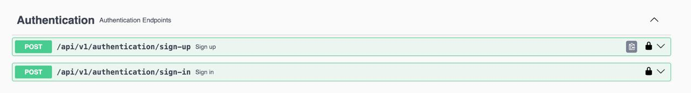
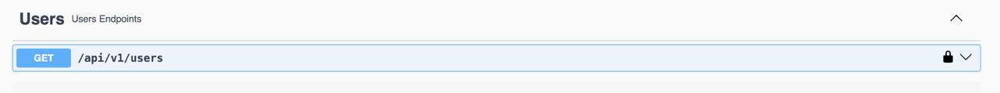
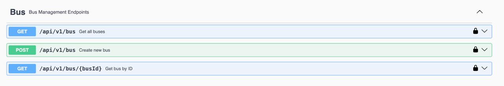

# CivaTours

Sistema de gestión de autobuses para CivaTours.

## Características

- Autenticación JWT
- Gestión de usuarios con roles
- API REST para gestión de autobuses
- Documentación con Swagger UI
- Base de datos PostgreSQL

## Endpoints

- **Autentication**

- **Users**

- **Bus**

## Tecnologías

- Spring Boot 3.5.6
- Java 21
- PostgreSQL
- JWT
- Swagger/OpenAPI
- Maven
